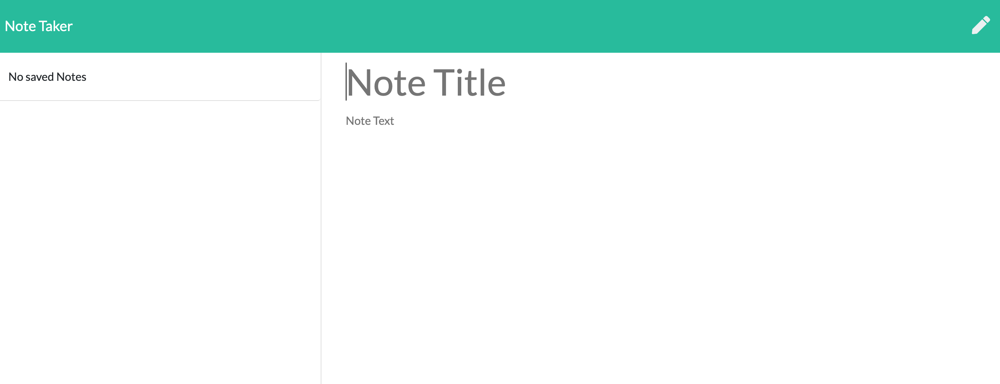

## Table of Contents

- [License](#license)
- [Description](#description)
- [Usage](#instructions)
- [Questions](#questions)

## License

## Description

Note Taker that can be used to write, save and delete notes.

<a href="https://jenya10016.github.io/note_taker/">Click here for github repository</a> 
<a href="https://note-taker-jenya.herokuapp.com/notes">Click here for heroku repository</a>

## Usage

Add note title
Add note text 
THEN click disk image to save 
TO DELETE NOTE click track icon

## Questions

Send questions to:  
Github: [Jenya Seletsky](https://github.com/Jenya10016)  
Email: js646@me.com  
Phone: 646-244-8249  
